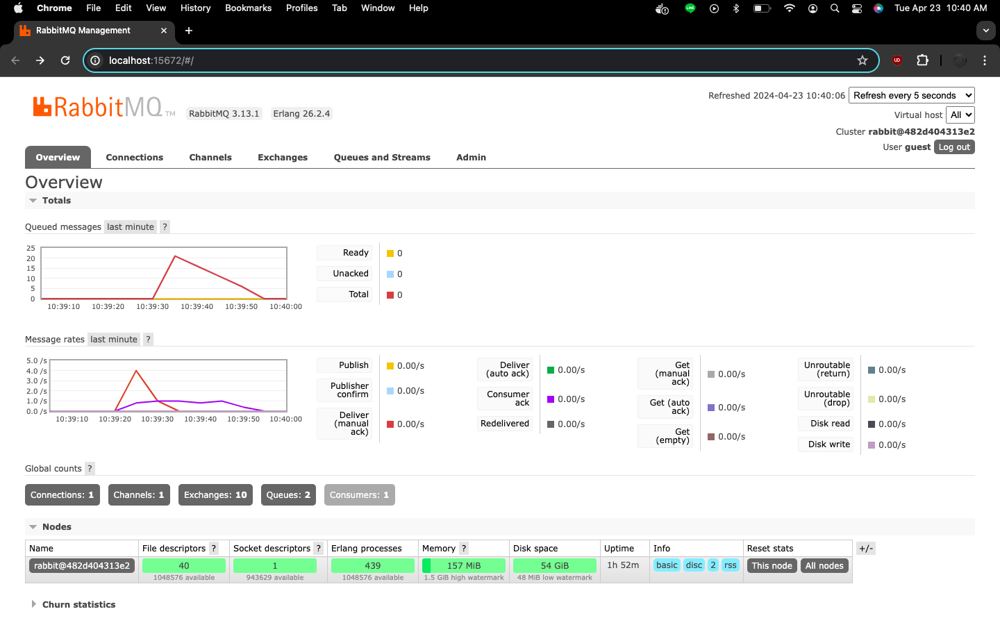
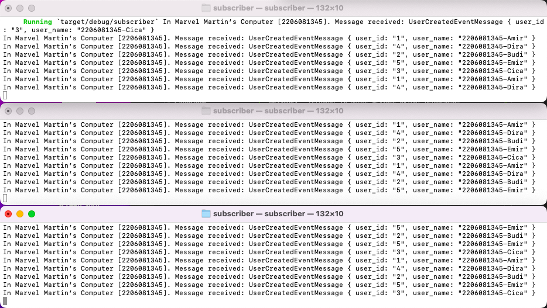

# Tutorial 8 - Crosstown Bus Poc Subscriber
AdvPro B - Marvel Martin Everthard - 2206081345

---

## Reflection
1. what is amqp?
> **Advanced Message Queuing Protocol (AMQP)** adalah protokol komunikasi yang **memungkinkan berbagai aplikasi** untuk **berkomunikasi secara asinkronus** dengan cara _passing message_ melalui _message broker_.

2. what it means? guest:guest@localhost:5672 , what is the first guest, and what is
the second guest, and what is localhost:5672 is for?
> `guest:guest@localhost:5672` merupakan bagian dari **URL** yang digunakan untuk mengonfigurasi **koneksi ke AMQP**.
> - `guest:guest` merupakan username dan password yang digunakan untuk terhubung ke AMQP. `guest` pertama merujuk ke **username**, sedangkan `guest` kedua merujuk ke **password**.
> - `localhost:5672` merupakan alamat host dan nomor port server AMQP. `localhost` mengacu pada **_local machine_** tempat kode dijalankan dan `5672` adalah **nomor port default** untuk komunikasi AMQP.

3. Simulation slow subscriber

> Hasil screenshot di atas menunjukkan grafik yang mensimulasikan slow subscriber. Pada grafik _queued messages_, terdapat 20 queue message akibat penambahan kode `thread::sleep(ten_millis);` pada subscriber dan menjalankan publisher secara berulang kali dengan cepat. Message tersebut nantinya akan di-_consume_ oleh subscriber, tapi secara lambat. Total queued message mencapai 20 karena program publisher dijalankan sebanyak **5 kali**.

4. Reflection and Running at least three
subscribers

> Hasil screenshot di atas menunjukkan grafik _queued message_ ketika dijalankan 3 subscriber pada console yang berbeda-beda. Pada grafik, dapat terlihat adanya **penurunan jumlah _queued message_ menjadi dibawah 10**, padahal program publisher dijalankan sebanyak 5 kali sama seperti sebelumnya. Hal ini terjadi dikarenakan _message_ di-_consume_ secara parallel oleh 3 subscriber yang berjalan secara _concurrently_ sehingga mempercepat proses konsumsi dan _queued messagenya_ jadi lebih sedikit.
